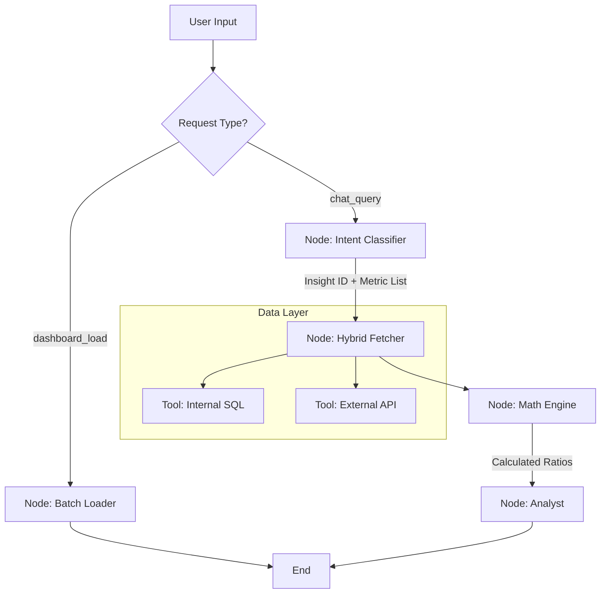

# Trading Analytics Platform - Technical Specification & Implementation Plan

## 1. AI Collaboration Workflow

**CRITICAL INSTRUCTION FOR AI AGENTS (Cursor/Composer):**
You must strictly adhere to the following workflow during the development of this project.

1. **Explain First:** Before writing any code, clearly explain the specific implementation step you are about to take.
2. **Wait for Approval:** Do not proceed with code generation or file modification until the user has explicitly approved the proposed plan.
3. **Implement on Confirmation:** Only write the code after receiving confirmation.
4. **Step-by-Step Execution:** This process must be repeated for every major component (e.g., State setup, Tool creation, Node logic, Graph wiring).
5. **No Assumptions:** If a library or logic is missing from this spec, ask the user before improvising.

---

## 2. Project Overview

This project builds a sophisticated AI-driven analytics platform for a trading company. The system architecture differentiates between two primary workflows:

1. 
**Dashboard Load (Fast Path):** A high-speed, SQL-only path to load static overview cards.


2. 
**Chat Query (Smart Path):** A deep-reasoning path involving SQL, External APIs, Math Engines, and LLM analysis.


### 2.1 Tech Stack

* 
**Orchestration:** LangGraph 


* 
**Tools:** LangChain 


* **Language:** Python 3.10+
* 
**Data Source:** BigQuery (Mocked for development) & External Market APIs 


### 2.2 Visual Architecture




---

## 3. Design Rationale & Gap Analysis

This architecture addresses specific requirements found during the design phase:

1. 
**Explicit Math Layer:** 


* 
*Problem:* LLMs are poor at arithmetic (e.g., calculating percentage differences between an internal metric and an external market metric).


* 
*Solution:* A dedicated `Math Engine` node is added after data fetching to perform reliable Python-based calculations on the combined dataset.


2. 
**Chat Memory:** 


* 
*Problem:* The bot needs context to answer follow-up questions like "What about last week?".


* 
*Solution:* The `AgentState` includes a `chat_history` field.


3. 
**Structured Output:** 


* 
*Problem:* Free-text LLM outputs are hard for the Frontend to render.


* 
*Solution:* The Analyst node returns strict JSON.


4. 
**Error Recovery:** 


* 
*Problem:* API failures shouldn't crash the app.


* 
*Solution:* Errors are logged in the state, allowing the Analyst to generate partial insights based on available data.


---

## 4. Phase 1: The "Brain" (State Definition)

We define a strict `TypedDict` state to manage the data flow. This state handles both the fast dashboard path and the complex chat context.

```python
from typing import TypedDict, List, Optional, Dict, Any
from langchain_core.messages import BaseMessage

class AgentState(TypedDict):
    # --- Input ---
    [cite_start]request_type: str                  # "dashboard_load" or "chat_query" [cite: 481, 484]
    [cite_start]chat_history: List[BaseMessage]    # MEMORY: Keeps track of conversation [cite: 485]
    [cite_start]user_query: Optional[str]          # Current question [cite: 486]
    
    # --- Classification ---
    [cite_start]target_domain: str                 # e.g., "Revenue & Monetization", "Risk" [cite: 14]
    [cite_start]mapped_insight_id: Optional[int]   # ID 1-18 (e.g., 17 for "Revenue Drop") [cite: 489]
    [cite_start]insight_name: Optional[str]        # Human readable name [cite: 490]
    
    # --- Data Layer ---
    [cite_start]required_metrics: List[str]        # Raw keys: ["internal_rev", "external_btc"] [cite: 491]
    [cite_start]fetched_data: Dict[str, Any]       # Raw results from SQL/API [cite: 491]
    [cite_start]derived_data: Dict[str, Any]       # MATH RESULTS: Calculated in Python [cite: 491]
    
    # --- Output ---
    [cite_start]root_cause_analysis: str           # The "Why" narrative generated by LLM [cite: 19]
    [cite_start]final_response: Dict[str, Any]     # JSON ready for Frontend rendering [cite: 494]
    [cite_start]errors: List[str]                  # Error log [cite: 495]

```

---

## 5. Phase 2: The Tools (LangChain)

We separate **Internal Calculations (Formulas)** from **External Context (APIs)**.

### 5.1 InternalMetricTool (The Formula Engine)

* 
**Function:** Calculates internal KPIs using BigQuery SQL.


* 
**Mechanism:** Maps a metric key to a pre-validated SQL formula.


* 
**Why:** Ensures dashboard numbers match finance reports.


```python
def run_internal_sql(metric_key: str) -> float:
    """Simulates BigQuery SQL execution."""
    # In production: run actual SQL query here
    print(f"   [Tool: SQL] Calculating '{metric_key}'...")
    mock_db = {
        "internal_revenue": 1500000,
        "internal_latency": 45,        # ms
        "internal_volatility": 12.5,
        "internal_arpu": 105.2,
        "internal_vip_retention": 0.94
    }
    return mock_db.get(metric_key, None)

```


### 5.2 ExternalMarketTool (The Context Engine)

* 
**Function:** Calls external APIs (Bloomberg, CoinGecko).


* 
**Why:** Needed for "Market Alignment" logic (e.g., explaining if a drop is global).


```python
def call_external_api(metric_key: str) -> float:
    """Simulates API Calls."""
    print(f"   [Tool: API] Fetching '{metric_key}'...")
    mock_api = {
        "external_btc_price": 64500.00,
        "external_market_volatility": 18.5,
        "external_competitor_rate": 0.02
    }
    return mock_api.get(metric_key, None)

```


---

## 6. Phase 3: The Nodes (Workflow Logic)

The Nodes represent the workers in our graph.

### Node A: The Dispatcher (Entry Point)

Decides if this is a fast dashboard load or a complex chat query.

```python
def node_dispatcher(state: AgentState):
    """Entry Point: Routes based on request type."""
    print(f"--- 1. DISPATCHER: Received {state['request_type']} ---")
    return {
        "errors": [], 
        "fetched_data": {}, 
        "derived_data": {}
    }

```


### Node B: Batch Loader (Fast Path)

Populates the 6 Domain Health Cards. Pure data fetching, no LLM.

```python
def node_batch_loader(state: AgentState):
    """Fast Dashboard Loader."""
    print("--- 2A. BATCH LOADER: Fetching Overview Cards ---")
    data = {
        "internal_revenue": run_internal_sql("internal_revenue"),
        "internal_latency": run_internal_sql("internal_latency")
    }
    return {
        "final_response": {"type": "dashboard_view", "data": data}
    }

```


### Node C: Intent Classifier (Chat Path)

Maps user questions to Insight IDs and determines required metrics.

```python
def node_classifier(state: AgentState):
    """Identifies the Insight ID and the metrics needed."""
    query = state["user_query"]
    print(f"--- CLASSIFIER: Processing '{query}' ---")
    
    # SIMULATED LLM DECISION
    # "Why did we lose money?" -> Insight 17
    return {
        "mapped_insight_id": 17,
        "insight_name": "Revenue Drop Root Cause",
        # Note: We ask for raw metrics here
        "required_metrics": ["internal_revenue", "internal_volatility", "external_market_volatility"]
    }

```


### Node D: The Hybrid Data Fetcher

Iterates through required metrics and routes to SQL or API tools based on the prefix (`internal_` vs `external_`).

```python
def node_hybrid_fetcher(state: AgentState):
    """Fetches Raw Data (SQL + API)."""
    print(f"--- FETCHER: Getting {state['required_metrics']} ---")
    
    fetched = {}
    errors = []
    
    for m in state["required_metrics"]:
        val = None
        if m.startswith("internal_"):
            val = run_internal_sql(m)
        elif m.startswith("external_"):
            val = call_external_api(m)
            
        if val is not None:
            fetched[m] = val
        else:
            errors.append(f"Missing data for {m}")
            
    return {"fetched_data": fetched, "errors": errors}

```


### Node E: The Math Engine (Logic Layer)

Performs explicit Python math on fetched data to support the Analyst.

```python
def node_math_engine(state: AgentState):
    """Performs Python Math on fetched data."""
    print("--- MATH ENGINE: Computing Derived Metrics ---")
    
    fetched = state["fetched_data"]
    derived = {}
    
    # Example Formula: Relative Volatility (External / Internal)
    if "external_market_volatility" in fetched and "internal_volatility" in fetched:
        try:
            ext_vol = fetched["external_market_volatility"]
            int_vol = fetched["internal_volatility"]
            # The Formula:
            ratio = ext_vol / int_vol if int_vol > 0 else 0
            derived["volatility_ratio"] = round(ratio, 2)
        except Exception as e:
            print(f"Math Error: {e}")

    return {"derived_data": derived}

```


### Node F: The Analyst (Root Cause Engine)

Generates the JSON narrative using Raw + Derived Data.

```python
def node_analyst(state: AgentState):
    """Generates the Narrative using Raw + Derived Data."""
    print("--- ANALYST: Generating Insight ---")
    
    # The LLM now sees the Math results too!
    data_context = {**state["fetched_data"], **state["derived_data"]}
    
    # SIMULATED LLM RESPONSE
    narrative = {
        "headline": "Revenue Stable Relative to Market Volatility",
        "analysis": f"While revenue is flat, the Market/Internal Volatility Ratio is {data_context.get('volatility_ratio')} (High). This indicates we are shielding users from broader market chaos.",
        "sentiment": "positive"
    }
    
    return {"final_response": narrative}

```


---

## 7. Phase 4: Graph Wiring & Execution

This connects all nodes into the final application.

```python
from langgraph.graph import StateGraph, END
import json

# --- Graph Construction ---
workflow = StateGraph(AgentState)

# Add Nodes
workflow.add_node("dispatcher", node_dispatcher)
workflow.add_node("batch_loader", node_batch_loader)
workflow.add_node("classifier", node_classifier)
workflow.add_node("fetcher", node_hybrid_fetcher)
workflow.add_node("math_engine", node_math_engine)
workflow.add_node("analyst", node_analyst)

# Set Entry Point
workflow.set_entry_point("dispatcher")

# Routing Logic
def route_request(state):
    return "batch_loader" if state["request_type"] == "dashboard_load" else "classifier"

workflow.add_conditional_edges("dispatcher", route_request, ["batch_loader", "classifier"])

# Chat Flow
workflow.add_edge("classifier", "fetcher")
workflow.add_edge("fetcher", "math_engine") # Fetch -> Math
workflow.add_edge("math_engine", "analyst") # Math -> Analyze
workflow.add_edge("analyst", END)
workflow.add_edge("batch_loader", END)

app = workflow.compile()

# --- Execution Example ---
if __name__ == "__main__":
    print("\n>>> SCENARIO: User asks complex question requiring Math <<<")
    
    inputs = {
        "request_type": "chat_query",
        "user_query": "How is our volatility compared to the market?",
        "chat_history": [], 
        "errors": []
    }
    
    result = app.invoke(inputs)
    
    print("\n>>> FINAL DASHBOARD JSON <<<")
    print(json.dumps(result["final_response"], indent=2))

```